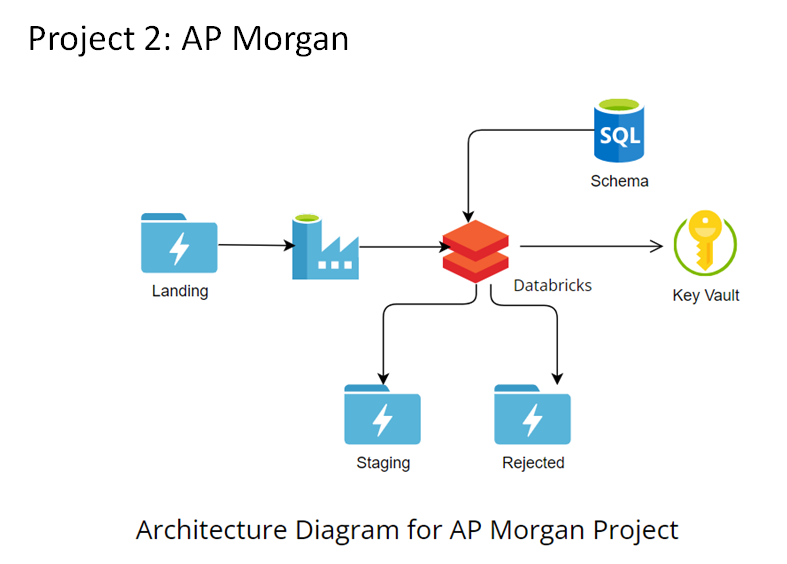

## Project Introduction:
Microsoft Azure project to clean and store data into respective folders based on the schema of data using Azure Databricks and Data Factory. This project uses Azure Databricks to implement a python notebook which scans the data received and then stores it in Azure storage account. This Data Factory pipeline is triggered using Storage Event function making the process fully automated.

## Technologies Used:
i.	Azure Databricks\
ii.	Azure Data Factory\
iii.	Azure Data Late Gen 2 Storage\
iv.	Azure Key Vault\
v.	Azure SQL Database\
## Project Stages:
1-	Data is received into Azure Gen 2 storage account using some 3rd party service.\
2-	From the landing folder, the data is then processed using Azure Databricks notebook.\
3-	The data schema is imported from Azure SQL database using linked service in Azure Databricks workspace.\
4-	When data is processed, then it is stored in either staging folder or rejected folder using python function.\
5-	Azure Data factory performs step 1 to 4 automatically on the storage event trigger.

## Project Outcomes:
This project allowed me to demonstrate my expertise in Azure technologies, particularly in using Azure Databricks and Data Factory to orchestrate complex data workflows. It highlights the power of Azure Databricks and Data Factory in automating the process of cleaning and storing data, which in turn saves a lot of time and effort. I am excited about the endless possibilities that Microsoft Azure offers and can't wait to explore more. If you're interested in learning more about this project or collaborating on similar projects, feel free to reach out to me!
